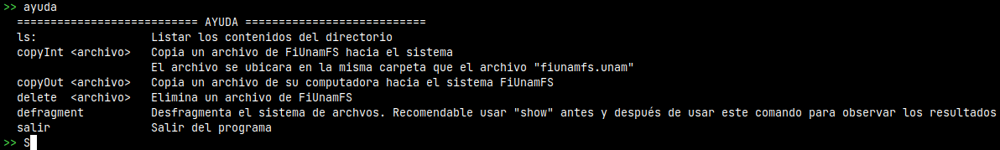
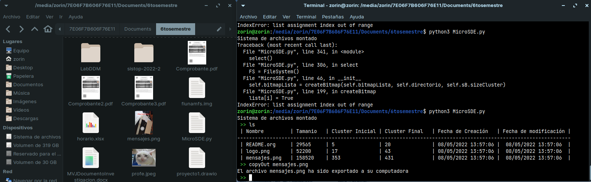

# Micro Sistema de Archivos

## Introducción

Sabemos que un sistema de archivos consiste en un *subsistema* del Sistema Operativo, encargado de la gestión de la memoria secundaria (información almacenada en aquellos medios de almacenamiento secundarios).
Esto nos proporciona (como usuarios) el concepto de archivo.

Esta vez nuestra tarea consistió en tomar como ejemplo el sistema de archivos proporcionado, y crear un programa que pudiera:
 1. Listar los contenidos del directorio
 2. Copiar un archivo del sistema FiUnamFS hacia la computadora
 3. Copiar un archivo de la computadora hacia el sistema FiUnamFS
 4. Eliminar un archivo del sistema FiUnamFS
 5. Desfragmentar al sistema de archivos

Antes de, la asignación menciona que 4 sectores de 256 bytes nos dan un cluster de 1024 bytes, aunque en realidad el sistema de archivos lo maneja a 2048 bytes

## Implementación ⌚

Esta es la primera vez que trato de hacer un programa Orientado a Objetos en Python. Como base, tengo 3 clases:
 * **superBloque**: Esta clase se encarga de obtener las especificaciones del sistema de archivos, en base a lo dado en el enunciado. El primer cluster se ve ocupado por estas especificaciones (no en su totalidad)
 * **archivoX**: Contiene solo atributos como el nombre, tamaño, cluster, etc, de un archivo en especifico. Se usa principalmente al obtener el listado del directorio así como para cuestiones de importar archivos hacia FiUnamFS
 * **File System**: Esta clase contiene todos los métodos creados para lograr los 5 puntos requeridos. En su método *\__init\__*, se genera el bitmap, el cual se representa como una lista que indica que clusters están ocupados y cuales no lo están

A su vez, FileSystem también se apoya de otros métodos que ya no se encuentran definidos dentro de la clase.

### File System Class

 * *ls()*: Este método se ejecuta por cada operación que se realizará sobre el sistema de archivos. Básicamente, por cada archivo en el directorio (los metadatos) se genera un objeto de la clase archivoX, modificando los atributos de este objeto, y posteriormente se guarda cada objeto que representa a un archivo distinto.
 * *copyInt()*: Nos sirve para importar un archivo hacia FiUnamFS. Primero se trata de abrir el archivo, para obtener los atributos y generar un objeto de la clase archivoX. Luego, por el nombre, se busca dentro del directorio, con el fin de encontrar posibles archivos duplicados. Finalmente, se comprueba el espacio existente dentro del directorio y del espacio de datos para poder guardar el nuevo archivo
 * *copyOut()*: Con una implementación más sencilla, verifica que el archivo a exportar exista dentro de FiUnamFS
 * *delete()*: Siguiendo la misma lógica, se comprueba la existencia del archivo. Luego, los cluster marcados como verdaderos en el *bitmap* son marcados como libres, y a su vez, se borra del directorio, de la lista del directorio, y del área de datos
 * *defragment()*: Profe, no salió :(. Para desfragmentar, al ser de asignación contigua, lo más común es pensar en recorrer los clusters con información, aunque esto implica tener que actualizar el cluster inicial de cada archivo en caso de que este se recorrió. Por desgracia, esta parte de la implementación no salió, pero le dejó mi intento

## ¿Cómo ejecutar?

Directamente en la terminal, puede escribir python3 MicroSDE.py, o también, puede abrir el archivo directamente haciendo doble clic (sobre interfaz gráfica)
Se sugiere no probra *"defragment"* porque el programa se congela 😞

Los comandos que pueden usarse son:
 * ls: Muestra los contenidos del directorio
 * copyInt <archivo>: Copia un archivo de la computadora hacia el sistema FiUnamFS
 * copyOut <archivo>: Exporta un archivo de FiUnamFS hacia la computadora
 * delete <archivo>: Elimina un archivo de FiUnamFS
 * salir: Termina la ejecución

## Pantallazos 🖥️
Primero, mostrando el comando de ayuda:
  

  
Ahora, mostrando el copiado de un archivo de la computadora hacia FiUnamFS, junto con el listado de los archivos:
  

  
El copiado de un archivo de FiUnamFS hacia la computadora, y la comprobación mediante la interfaz:
  

  
Eliminado de un archivo:
  

  
  
## Referencias
Python Software Foundation (2022) *Time - time access and conversions*. Obtenido de: (https://docs.python.org/3/library/time.html#time.struct_time)
